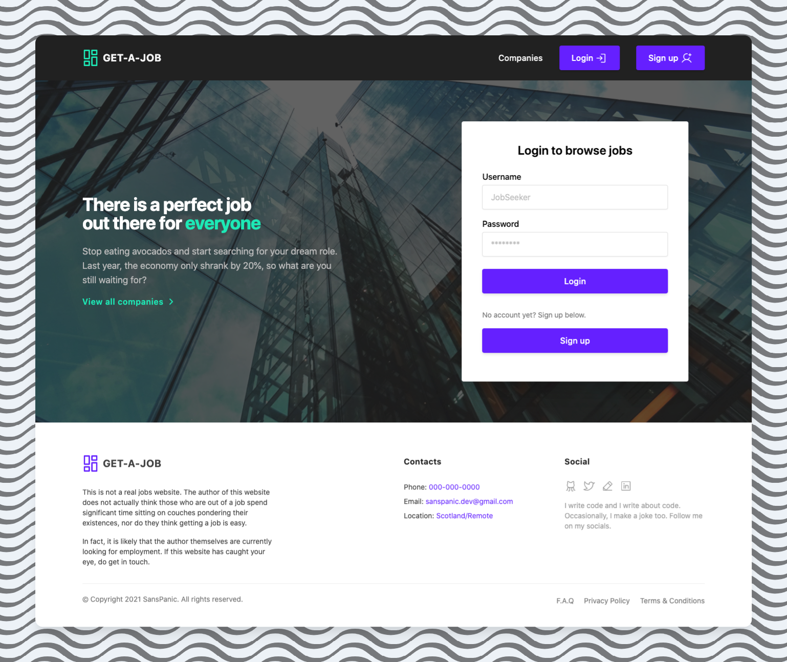
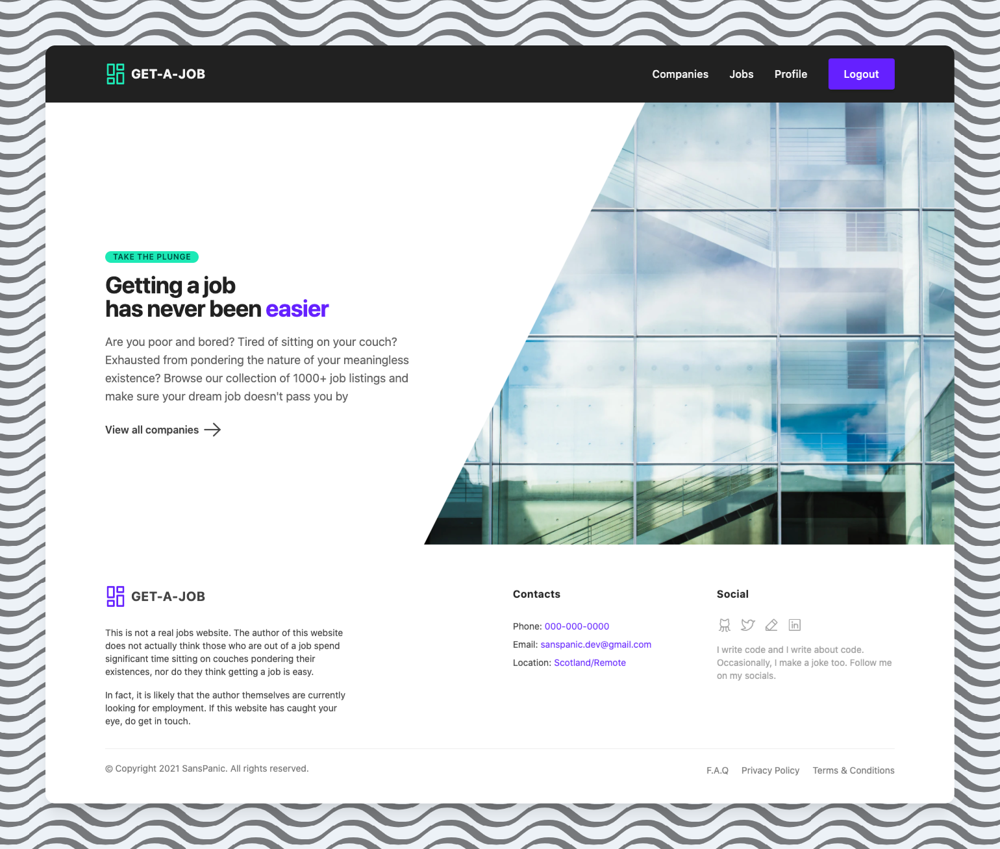

# GET-A-JOB FRONTEND :briefcase: 

This is a React frontend for a fake jobs application website to go along with [this](https://github.com/sanspanic/Jobly-Backend) backend.

This project was bootstrapped with [Create React App](https://github.com/facebook/create-react-app).

## Technologies :woman_scientist:

1. JavaScript
2. React, Create React App
3. Jest
4. Tailwind CSS
5. React-router-dom
6. Axios
7. Additional libraries: icons, uuid

## Features :palm_tree:

1. Registration and Authentication
2. Filtering and searching for companies or jobs
3. Editing profile information
4. "Applying" for jobs and dislaying list of applied-to jobs

## Approach :woman_student:

1. Created reusable components representing Job, Company, Profile, Forms, etc
2. Implemented routing via react-router-dom switch component
3. Authentication via JWTs, localStorage used to enable user to persist between refreshes and browser closing/opening
4. Included error handling and pages: for unsuccessful API call, unauthorised access, for missing page & wrong URL
5. Testing: smoke tests, snapshot tests and unit tests via Jest

## For developers: 

##### To run: 

`npm start`

Runs the app in the development mode.\
Open [http://localhost:3000](http://localhost:3000) to view it in the browser.

The page will reload if you make edits.\
You will also see any lint errors in the console.

Backend ([repo](https://github.com/sanspanic/Jobly-Backend)) can be run on port 3001. 

##### To run tests: 

`npm test`

Launches the test runner in the interactive watch mode.\
See the section about [running tests](https://facebook.github.io/create-react-app/docs/running-tests) for more information.

##### To build for production: 

`npm run build`

Builds the app for production to the `build` folder.\
It correctly bundles React in production mode and optimizes the build for the best performance.

The build is minified and the filenames include the hashes.\
Your app is ready to be deployed!

## Design Resources 

* [TailwindCSS](https://tailwindcss.com/)
* [Kitwind](https://kitwind.io/)
* [Phosphor Icons](https://phosphoricons.com/)
* [Fontawesome Icons](https://fontawesome.com/)
* [Registration Form](https://tailwindcomponents.com/)
* [Illustrations](https://error404.fun/)

## Screengrabs
#### Login Page

#### Homepage

